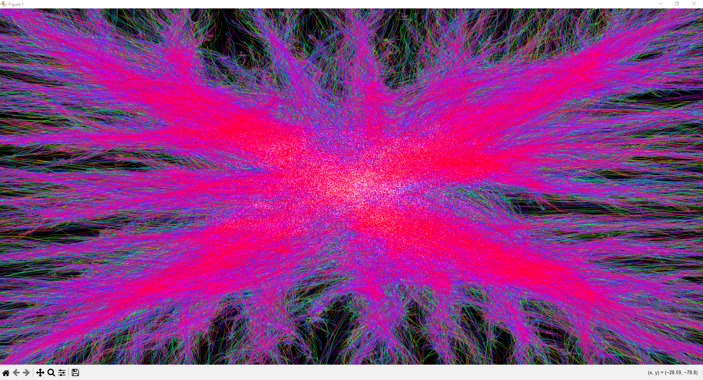

N-Body Gravity Simulation mit Numba CUDA
---

## Vorschau

<!-- Screenshot oder GIF der laufenden Simulation -->


---

## Was ist das?

Eine 2D-Gravitationssimulation bei der sich 25.000 Teilchen gegenseitig anziehen. Jedes Teilchen zieht jedes andere an, das sind 625 Millionen Kraftberechnungen pro Zeitschritt.

---

## Code

### Parameter

```python
N      = 25000
t_end  = np.float32(60.0)
steps  = 800
G      = np.float32(1.0)
EPS2   = np.float32(0.25)   # = 0.5², vorab berechnet

THREADS = 128
BLOCKS  = math.ceil(N / THREADS)   # = 196
TILE    = THREADS
```

`float32` statt `float64` halbiert den GPU-Speicherbedarf und ist somit schneller. Viele Kerne haben für float64 nur ein Viertel des Durchsatzes. Die Präzision von 7 Dezimalstellen reicht für dieses Programm vollkommen aus.

`EPS2 = 0.25` ist ein vorberechnetes `ε² = 0.5²`. Ohne es würde `1/sqrt(0)` ins Unendliche gehen wenn zwei Teilchen am gleichen Ort landen. Mit ihm bleibt die Kraft immer endlich:

```
r² = dx² + dy² + ε²
```

`THREADS = 128` pro Block ist auf die Warp-Größe von Nvidia-GPUs abgestimmt (ein Warp = 32 Threads, 128 = 4 Warps). Für 25000 Teilchen snd das 196 Blöcke × 128 Threads = 25.088 die überschüssigen 88 Threads werden per `if i < n` abgefangen.

---

### Das CUDA-Execution-Model

`gravity_kernel[BLOCKS, THREADS](...)` startet alle Threads. Jeder Thread bekommt über `cuda.grid(1)` seine eindeutige globale ID `i` und berechnet genau die Kraft auf Teilchen `i`. 

```
Grid
├── Block 0   → Thread 0–127   → Teilchen 0–127
├── Block 1   → Thread 128–255 → Teilchen 128–255
├── Block 2   → Thread 256–383 → Teilchen 256–383
│   ...
└── Block 195 → Thread 24960–25087 → Teilchen 24960–24999
```

Durch das kommunizieren der Threads innerhalbs eines Blocks über **Shared Memory** ist der Gravitationskern schnell. 

---

### Gravitationskern:

```python
@cuda.jit(fastmath=True)
def gravity_kernel(pos, masses, acc, G, eps2):
    i  = cuda.grid(1)        # = blockIdx.x * blockDim.x + threadIdx.x
    tx = cuda.threadIdx.x    # Position dieses Threads innerhalb seines Blocks (0–127)
    n  = pos.shape[0]

    # Shared Memory: liegt physisch auf dem SM-Chip, ~100× schneller als Global Memory
    s_pos  = cuda.shared.array((128, 2), dtype=float32)
    s_mass = cuda.shared.array((128,),   dtype=float32)
```

`cuda.shared.array` reserviert Speicher direkt auf dem **Streaming Multiprocessor (SM)** dem Chip-Die der GPU, nicht im langsamen DRAM. Dieser Speicher ist pro Block privat: Block 0 und Block 1 haben je ihr eigenes `s_pos`, sie teilen ihn nicht.

---

### Gravitationskern: Tiling-Schleife

Jedes der 25.000 Teilchen braucht die Position und Masse aller anderen 25.000 Teilchen. Die liegen im **Global Memory**. Jeder Zugriff braucht 400–800 Taktzyklen.

Ohne Optimierung würden insgesamt 625 Millionen Lesevorgänge passieren.

**Tiling**: Die 25.000 Teilchen werden in Tiles von je 128 aufgeteilt. Alle 128 Threads eines Blocks laden kooperativ eine Tile in den Shared Memory. Danach rechnen alle 128 Threads gegen diese 128 gecachten Einträge, ohne nochmal auf den DRAM zuzugreifen.

```python
    for tile_start in range(0, n, TILE):   # 0, 128, 256, ... 24960

        # ── Phase 1: kooperatives Laden ──────────────────────────────────────
        # Jeder Thread lädt genau einen Eintrag: seinen eigenen Slot tx
        j_load = tile_start + tx
        if j_load < n:
            s_pos[tx, 0] = pos[j_load, 0]
            s_pos[tx, 1] = pos[j_load, 1]
            s_mass[tx]   = masses[j_load]
        else:
            s_pos[tx, 0] = float32(0.0)    # Padding für den letzten unvollständigen Tile
            s_pos[tx, 1] = float32(0.0)
            s_mass[tx]   = float32(0.0)

        # Barriere: kein Thread darf Phase 2 betreten bevor Phase 1 vollständig ist.
        # Ohne syncthreads() könnte Thread 0 bereits gegen s_pos[99] rechnen,
        # während Thread 99 diesen Slot noch nicht geschrieben hat.
        cuda.syncthreads()

        # ── Phase 2: Kraftberechnung gegen gecachte Daten ────────────────────
        if i < n:
            for k in range(TILE):
                dx = s_pos[k, 0] - xi
                dy = s_pos[k, 1] - yi
                r2 = dx*dx + dy*dy + eps2

                inv_r  = float32(1.0) / math.sqrt(r2)
                inv_r3 = inv_r * inv_r * inv_r    # 1/r³ aus drei Multiplikationen,
                                                   # nicht math.pow() — deutlich schneller

                fac = G * s_mass[k] * inv_r3
                ax += fac * dx
                ay += fac * dy

        # Zweite Barriere: kein Thread darf die nächste Kachel laden bevor
        # alle Phase 2 abgeschlossen haben — sonst würde s_pos überschrieben
        # während ein langsamer Thread noch darin liest.
        cuda.syncthreads()

    if i < n:
        acc[i, 0] = ax    # Ergebnis zurück in Global Memory schreiben —
        acc[i, 1] = ay    # nur 1× pro Kernel-Aufruf notwendig
```

In jedem Durchlauf lädt ein Thread-Block einen Teil der Teilchen in den **Shared Memory**. Jeder Thread übernimmt dabei ein Teilchen und speichert dessen Position und Masse zwischen.

Danach warten alle Threads mit `cuda.syncthreads()`, bis das Laden vollständig abgeschlossen ist. Erst dann beginnt die Kraftberechnung. Dadurch ist sichergestellt, dass kein Thread mit unvollständigen Daten rechnet.

Anschließend berechnet jeder Thread die Gravitationswirkung aller Teilchen aus dem aktuellen Tile auf sein eigenes Teilchen. Die Werte `dx`, `dy`, `r²`, `1/r` und `1/r³` werden verwendet, um die Beschleunigung in x- und y-Richtung aufzusummieren.

Nach der Berechnung folgt eine zweite Synchronisation. Sie verhindert, dass ein Thread schon das nächste Tile in den Shared Memory lädt, während ein anderer Thread noch Daten aus dem aktuellen Tile liest.

Am Ende schreibt jeder Thread seine fertig berechnete Beschleunigung genau einmal zurück in den globalen Speicher.

---

### Kernel-Aufruf-Syntax: `[BLOCKS, THREADS]`

```python
gravity_kernel[BLOCKS, THREADS](pos, m, acc, G, EPS2)
#              └──────────────┘
#              Launch-Konfiguration: kein Python-Argument,
#              sondern eine CUDA-Direktive an den GPU-Treiber
```

Die eckigen Klammern sind Numbas Syntax für die **Launch-Konfiguration**. Sie teilt dem CUDA-Treiber mit, wie viele Blöcke und wie viele Threads pro Block gestartet werden sollen. Der Kernel liest sie intern über `cuda.gridDim.x` und `cuda.blockDim.x` aus.

---

### Leapfrog-Integration

```python
# Schritt pro Zeiteinheit dt = 60s / 800 = 0.075s

# 1. Halber Kick: Geschwindigkeit um ½·dt vorwärts
# 2. Voller Drift: Position mit neuer Geschwindigkeit vorwärts
drift_kernel[BLOCKS, THREADS](pos, vel, acc, dt)
# vel[i] += 0.5 * dt * acc[i]
# pos[i] += dt * vel[i]

# 3. Beschleunigung an der neuen Position neu berechnen
gravity_kernel[BLOCKS, THREADS](pos, m, acc, G, EPS2)

# 4. Zweiter halber Kick: Geschwindigkeit mit neuer Beschleunigung fertigstellen
kick_kernel[BLOCKS, THREADS](vel, acc, dt)
# vel[i] += 0.5 * dt * acc[i]
```
Beim Drift werden zuerst die Positionen aller Teilchen aktualisiert. Danach berechnet die GPU für jedes Teilchen die neue Gravitationskraft beziehungsweise Beschleunigung. Erst wenn diese neuen Beschleunigungen bekannt sind, können im Kick die Geschwindigkeiten aktualisiert werden.

Diese Schritte sind deshalb getrennte CUDA-Kernel. Die Gravitationsberechnung braucht nämlich die bereits aktualisierten Positionen aller Teilchen. Würde man alles in einen einzigen großen Kernel packen, wäre die Reihenfolge schwerer sauber einzuhalten. Mehrere kleinere Kernel machen den Ablauf klarer und können von CUDA effizient geplant werden.

Für die Zeitintegration wird der Leapfrog-Algorithmus verwendet. Er ist für physikalische Simulationen besser geeignet als ein einfaches Euler-Verfahren, weil er die Energie des Systems deutlich stabiler hält. Die Teilchen bewegen sich über viele Zeitschritte hinweg realistischer.

---

### Der abschließende GPU-CPU-Transfer

```python
# Auf der GPU alloziert: (801, 25000, 2) × 4 Byte = ~160 MB GPU-VRAM
traj_gpu = cuda.device_array((steps + 1, N, 2), dtype=np.float32)

# Nach jedem Schritt: nur schreiben, nie lesen
save_traj_kernel[BLOCKS, THREADS](pos, traj_gpu, step)

# Am Ende: ein einziger DMA-Transfer über PCIe
return traj_gpu.copy_to_host()
```

`copy_to_host()` transferiert einmal die GPU-Daten auf die CPU. 

---

### Visualisierung

```python
colors = plt.cm.hsv(np.linspace(0, 1, N))   # Jedes Teilchen bekommt eine Farbe

def update(frame):
    particles.set_offsets(traj[frame])

    # traj[:frame+1] hat Form (Zeit, N, 2)
    # Nach transpose: (N, Zeit, 2) — jedes Teilchen bekommt seinen eigenen Schweif
    segments = np.transpose(traj[:frame + 1], (1, 0, 2))
    trails.set_segments(segments)
```

`np.transpose((1, 0, 2))` tauscht die ersten zwei Achsen weil `LineCollection` erwartet genau dieses Format. Eine Liste von Linienzügen, einer pro Teilchen.

---

## Performance-Vergleich

GPU vs. CPU

CPU: AMD Ryzen 9 3900X 12-Kerne  GPU: NVIDIA RTX 3070 Ti(8 GB)

| Teilchen (N) | CPU (NumPy) | CPU(Numpy mit odeint) | GPU (CUDA) | Speedup(Numpy vs. GPU) |
|:------------:|------------:|----------------------:|:----------:|:----------------------:|
|      50      |      30,3 s |                10,3 s |   0,7 s    |          43 x          |
|     100      |     238,4 s |               135,8 s |   0,7 s    |         341 x          |
|     1000     |      ~2,6 T |              1559,9 s |   0,7 s    |       321.000 x        |
|    10.000    |      ~6,8 J |               ~17,7 h |   1,0 s    |       214 Mio. x       |
|    50.000    |      ~814 J |                ~8,7 T |   7,7 s    |        3 Mrd. x        |
|   100.000    |   ~6404,5 J |                 ~25 T |   26,5 s   |        8 Mrd. x        |